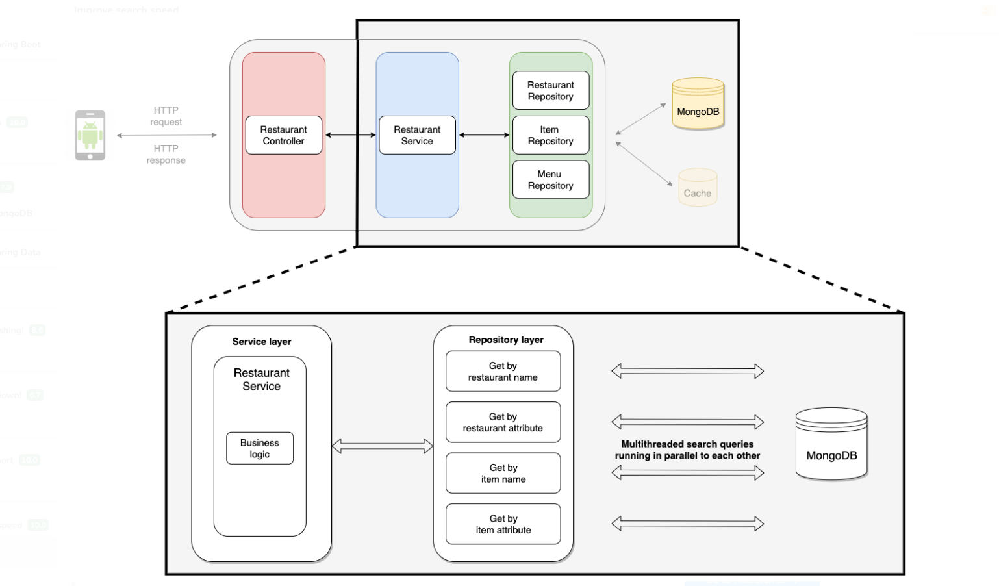

# QEats

QEats is a popular food ordering app that allows users to browse and order their favorite dishes from nearby restaurants.

## Project Overview

During the course of this project, the following features and improvements were implemented:

- Developed various components of the QEats backend, which is a Spring Boot application.
- Implemented multiple REST API endpoints to fetch restaurant information and process food orders.
- Enhanced app performance to handle large-scale load scenarios effectively.
- Integrated an advanced search feature to improve user experience and discoverability.

This project showcases expertise in backend development, API design, performance optimization, and feature enhancements for a high-traffic food ordering application.

